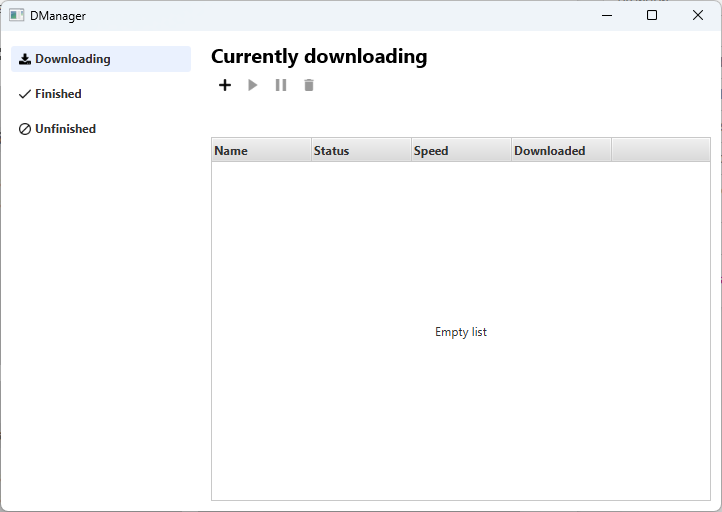
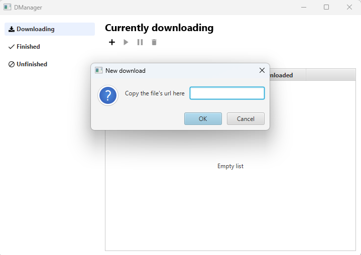
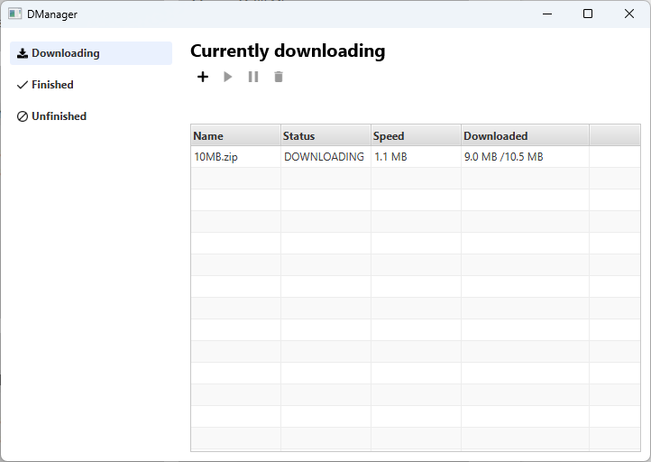
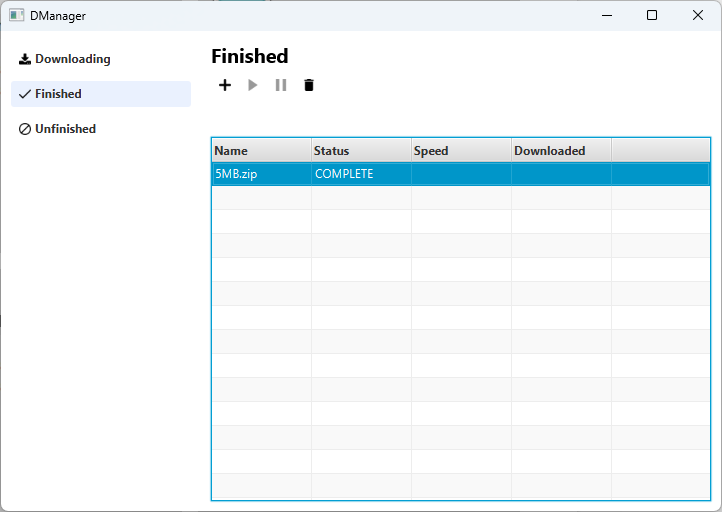
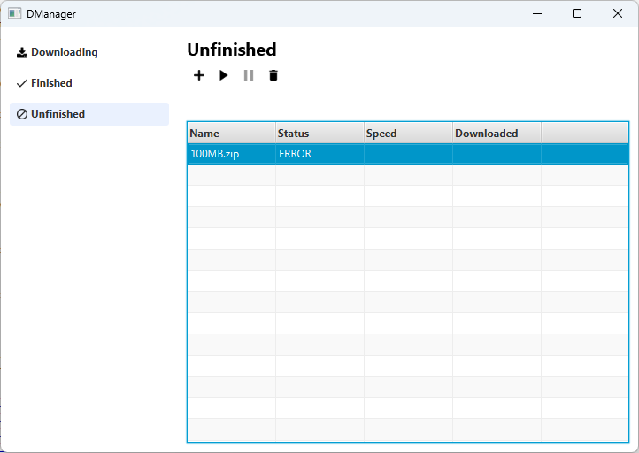

# DManager

## Overview
**DManager** is a desktop app written in Java and JavaFX that basically manages multiple pausable file downloads, it makes use of the [**dmanager-lib**](https://github.com/ramirafrafi/dmanager-lib) library.

## Screenshots

### Launch screen

### New download dialog

### Current downloads screen

### Finished downloads screen

### Unfinished downloads screen

